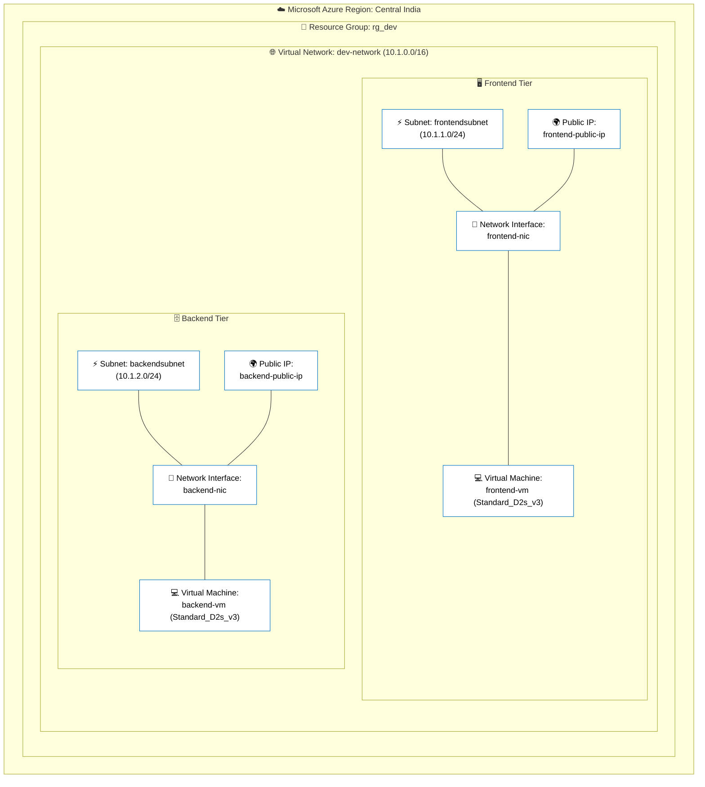
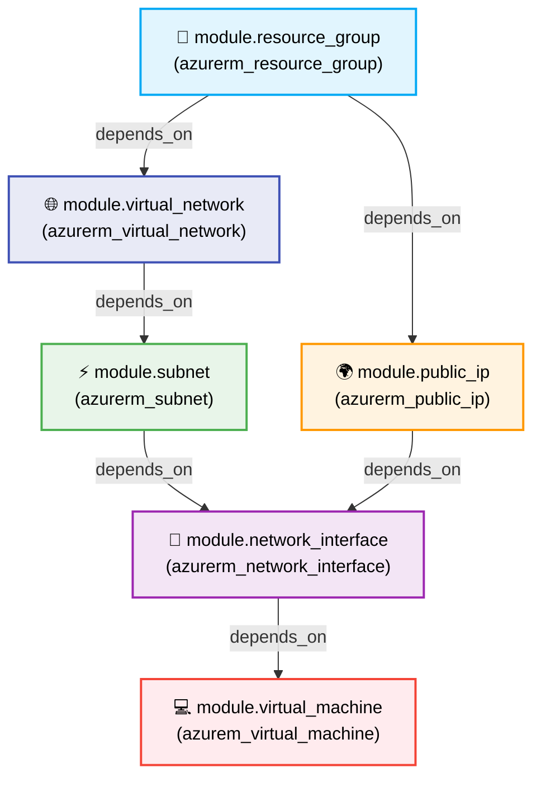

# 🚀 Azure Modular Infrastructure as Code (IaC) with Terraform

[](https://www.terraform.io/)
[](https://azure.microsoft.com/)
[](https://github.com/)
[](https://opensource.org/licenses/MIT)

Welcome to **azure-terraform-modular-iac** — a modular, scalable, and reusable **Infrastructure as Code (IaC)** project designed to automate the provisioning of Microsoft Azure cloud resources using **Terraform**. 

This repository showcases enterprise-grade cloud automation practices, modular architecture design, and multi-tier environment provisioning.

---

## 🏗️ Architecture & Topology Diagram

The diagram below illustrates the 2-Tier cloud infrastructure topology deployed in Microsoft Azure (**Central India** region) by the `Dev` environment configuration:



---

## 🔄 Terraform Module Dependency Graph

This project follows a strict dependency hierarchy to ensure resources are created in the correct order without race conditions:



---

## 📂 Repository Structure

The codebase is organized into **Child Modules** (reusable building blocks) and **Environments** (specific deployment configurations):

```text
azure-terraform-modular-iac/
├── Child_Modules/                   # Reusable Terraform Modules
│   ├── azurem_virtual_machine/      # Virtual Machine module
│   ├── azurerm_network_interface/   # Network Interface (NIC) module
│   ├── azurerm_network_security_group/ # Network Security Group (NSG) module
│   ├── azurerm_public_ip/           # Public IP module
│   ├── azurerm_resource_group/      # Resource Group module
│   ├── azurerm_subnet/              # Subnet module
│   └── azurerm_virtual_network/     # Virtual Network (VNet) module
├── Environment/
│   └── Dev/                         # Development Environment Deployment
│       ├── main.tf                  # Root module invoking child modules
│       ├── provider.tf              # Azure provider configuration
│       ├── variables.tf             # Variable declarations
│       └── terraform.tfvars         # Environment variable values
└── README.md                        # Project documentation
```

---

## 🧩 Child Modules Overview

Each child module is decoupled and designed to accept dynamic variable inputs using Terraform `for_each` loops, allowing deployment of single or multiple instances seamlessly:

| Module Name | Description | Key Managed Resources |
| :--- | :--- | :--- |
| **`azurerm_resource_group`** | Provisions Azure Resource Groups to serve as logical containers for infrastructure. | `azurerm_resource_group` |
| **`azurerm_virtual_network`** | Creates virtual networks with configurable address spaces. | `azurerm_virtual_network` |
| **`azurerm_subnet`** | Segments VNets into isolated subnets (e.g., Frontend and Backend). | `azurerm_subnet` |
| **`azurerm_public_ip`** | Generates static or dynamic Public IP addresses for external connectivity. | `azurerm_public_ip` |
| **`azurerm_network_interface`** | Creates NICs and binds them to Subnets and Public IP addresses. | `azurerm_network_interface` |
| **`azurerm_network_security_group`** | Manages security rules for inbound and outbound network traffic filtering. | `azurerm_network_security_group` |
| **`azurem_virtual_machine`** | Deploys Azure Virtual Machines with compute sizing, OS image, and credentials. | `azurerm_linux_virtual_machine` / `azurerm_windows_virtual_machine` |

---

## 🌍 Dev Environment Specifications

The current deployment in `Environment/Dev/terraform.tfvars` provisions the following resources:

* **Resource Group**: `rg_dev` located in `centralindia`.
* **Virtual Network**: `dev-network` with address space `10.1.0.0/16`.
* **Subnets**:
  * `frontendsubnet` (`10.1.1.0/24`) — Dedicated for web/frontend compute.
  * `backendsubnet` (`10.1.2.0/24`) — Dedicated for application/database services.
* **Public IPs**: Static IP allocations (`frontend-public-ip` and `backend-public-ip`).
* **Compute Instances**:
  * `frontend-vm`: Size `Standard_D2s_v3`, connected to `frontend-nic`.
  * `backend-vm`: Size `Standard_D2s_v3`, connected to `backend-nic`.

---

## 🛠️ Prerequisites

Before executing the code in this repository, ensure you have the following installed and configured:

1. **[Terraform](https://developer.hashicorp.com/terraform/install)** (v1.0.0 or higher)
2. **[Azure CLI](https://learn.microsoft.com/en-us/cli/azure/install-azure-cli)** (`az`)
3. An active **Microsoft Azure Subscription** with appropriate permissions (Contributor/Owner) to create resources.

---

## 🚀 Getting Started & Usage

Follow these steps to deploy the infrastructure to your Azure subscription:

### 1. Authenticate to Azure
Login using the Azure CLI and select your target subscription:
```bash
az login
az account set --subscription "<YOUR_SUBSCRIPTION_ID_OR_NAME>"
```

### 2. Navigate to Target Environment
Change your working directory to the environment you wish to deploy (e.g., `Dev`):
```bash
cd Environment/Dev
```

### 3. Initialize Terraform
Download provider plugins and initialize the working directory:
```bash
terraform init
```

### 4. Validate & Format Code
Ensure syntax correctness and proper formatting:
```bash
terraform fmt -recursive
terraform validate
```

### 5. Review Execution Plan
Generate a dry-run plan to verify what resources Terraform will create, update, or destroy:
```bash
terraform plan
```

### 6. Apply Infrastructure
Provision the resources in Azure (type `yes` when prompted, or use `-auto-approve` for CI/CD automation):
```bash
terraform apply
```

### 7. Destroy Infrastructure (Cleanup)
When the environment is no longer needed, tear down all deployed resources to prevent unwanted Azure charges:
```bash
terraform destroy
```

---

## 🔐 Security & Best Practices (Future Plan)

When extending or deploying this project in production environments, consider the following DevSecOps recommendations:

1. **Secret Management**: Avoid storing plaintext credentials (such as `admin_password`) directly in `terraform.tfvars`. Instead, utilize **Azure Key Vault**, Terraform sensitive variables, or environment variables (`TF_VAR_admin_password`).
2. **Remote State Storage**: Migrate the local `terraform.tfstate` file to an encrypted **Azure Blob Storage Container** with state locking enabled via Azure Storage Account.
3. **Network Security**: Associate **Network Security Groups (NSGs)** to subnets or NICs to restrict inbound ports (e.g., allow SSH/RDP only from trusted IP ranges or via **Azure Bastion**).
4. **Least Privilege Access**: Execute Terraform pipelines using an Azure Service Principal or Managed Identity with scoped permissions rather than a personal user account.

---

## 🎯 Goals & Learning Focus

This project serves as a practical implementation to mastering:
* ☁️ Cloud Infrastructure Architecture in Microsoft Azure
* ⚙️ Infrastructure Automation & Reusability with Terraform
* 🔐 DevSecOps Practices & Security Compliance
* 🚀 Scalable CI/CD Pipeline Integrations (GitHub Actions & Azure DevOps)
* 🐳 Cloud-Native Engineering & Kubernetes (AKS) integrations

---

⭐ **Learning. Building. Automating. Securing.**
